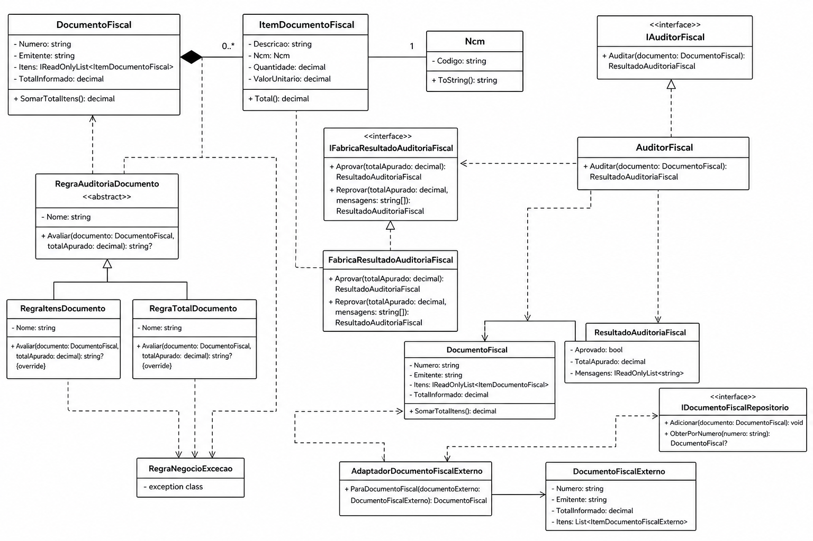

# Sped Fiscal Auditoria Dominio

## Projeto
Este projeto modela o dominio de Auditoria Fiscal em C#/.NET, propondo apoio a um processo de conferencia de documentos fiscais para identificar inconsistencias, validar campos relevantes e organizar regras de negocio de forma auditavel. Em termos tecnicos, aplica Orientacao a Objetos, Domain-Driven Design, SOLID, GRASP e testes unitarios para estruturar essas regras de forma clara, isolada e consistente.

## Modelagem do Dominio

## Problema E Solucao

O problema tratado e a necessidade de conferir documentos fiscais de forma consistente, reduzindo erros de lancamento, divergencias de total e inconsistencias em dados basicos e NCM. A solucao desenvolvida e um dominio de auditoria fiscal que valida o documento, calcula o total apurado, compara com o total informado e devolve um resultado aprovado ou reprovado com mensagens de divergencia.

### Problema a ser resolvido
Garantir a auditoria consistente de documentos fiscais e apoiar a conferencia fiscal antes do fechamento contabil e tributario, reduzindo erros manuais, retrabalho e inconsistencias de lancamento. Para isso, o dominio valida:
- dados basicos do documento;
- itens e seus totais;
- NCM dos itens;
- divergencia entre total informado e total apurado;
- regras de auditoria isoladas em servicos e factories;
- integracao com dados externos sem contaminar o dominio.

## Escopo

### Interno
- `DocumentoFiscal` como raiz do agregado.
- `ItemDocumentoFiscal` e `Ncm` como parte do modelo interno de dominio.
- `AuditorFiscal` como coordenador das regras de auditoria.
- `FabricaResultadoAuditoriaFiscal` como construtor dos resultados.
- `RegraAuditoriaDocumento`, `RegraItensDocumento` e `RegraTotalDocumento` como regras internas.
- `AdaptadorDocumentoFiscalExterno` como porta de entrada para converter o formato externo para o dominio.

### Externo
- Sistemas que fornecem `DocumentoFiscalExterno`.
- Pessoas que consomem o resultado da auditoria, como analistas fiscais ou contabeis.
- Repositorio de documentos fiscais, quando houver persistencia fora do dominio.

## Usuarios E Interfaces

- Analista fiscal ou contabil: consulta o resultado da auditoria e trata divergencias.
- Sistema externo de integracao: envia documentos no formato `DocumentoFiscalExterno`.
- Camada de persistencia: interage com `IDocumentoFiscalRepositorio` quando o documento precisa ser armazenado ou recuperado.

## Regras De Negocio

- O numero do documento deve ser informado.
- O emitente deve ser informado.
- O documento pode ser composto por zero ou mais itens.
- Cada item deve ter descricao, NCM valido, quantidade maior que zero e valor unitario nao negativo.
- O NCM deve conter exatamente 8 digitos numericos.
- O total apurado e a soma dos totais dos itens.
- O documento e reprovado quando o total informado difere do total apurado.
- O documento e reprovado quando nao possui itens.

## Conceitos Observados
- Ubiquitous Language: DocumentoFiscal, ItemDocumentoFiscal, Ncm, AuditorFiscal, ResultadoAuditoriaFiscal.
- Entidade e ObjetoDeValor: DocumentoFiscal como raiz do agregado, ItemDocumentoFiscal e Ncm como objetos sem identidade.
- Repository: abstracao em IDocumentoFiscalRepositorio.
- Aggregate, Bounded Context e Servico de dominio: DocumentoFiscal como agregado, contexto de Auditoria Fiscal e AuditorFiscal como servico de dominio.
- Servico de dominio e Factory: AuditorFiscal executa a regra; FabricaResultadoAuditoriaFiscal monta o resultado.
- Anti-Corruption Layer e Context Map: AdaptadorDocumentoFiscalExterno converte DocumentoFiscalExterno para o modelo interno.

Projeto de dominio em C#/.NET com foco em DDD e testes unitarios, sem camada de aplicacao.

## Como validar

- `dotnet build .\SpedFiscalAuditoriaDominio.sln`
- `dotnet test .\SpedFiscalAuditoriaDominio.sln --no-restore`
- `dotnet test .\tests\SpedFiscalAuditoriaDominio.Testes\SpedFiscalAuditoriaDominio.Testes.csproj --no-build --collect:"XPlat Code Coverage"`

## Checklist de Rubricas

| Rubrica | Codigo real |
|---|---|
| 1. Aplicar os conceitos de Orientacao a Objetos com C# - Encapsulamento, Abstracao, Heranca e Polimorfismo | [`src/SpedFiscalAuditoriaDominio/Dominio/Servico/RegraAuditoriaDocumento.cs`](./src/SpedFiscalAuditoriaDominio/Dominio/Servico/RegraAuditoriaDocumento.cs#L1-L12), [`src/SpedFiscalAuditoriaDominio/Dominio/Servico/RegraItensDocumento.cs`](./src/SpedFiscalAuditoriaDominio/Dominio/Servico/RegraItensDocumento.cs#L1-L19), [`src/SpedFiscalAuditoriaDominio/Dominio/Servico/RegraTotalDocumento.cs`](./src/SpedFiscalAuditoriaDominio/Dominio/Servico/RegraTotalDocumento.cs#L1-L19), [`src/SpedFiscalAuditoriaDominio/Dominio/Entidade/DocumentoFiscal.cs`](./src/SpedFiscalAuditoriaDominio/Dominio/Entidade/DocumentoFiscal.cs#L1-L42) |
| 1. Aplicar os conceitos de Orientacao a Objetos com C# - Modificadores de acesso, propriedades, metodos e construtores | [`src/SpedFiscalAuditoriaDominio/Dominio/ObjetoDeValor/Ncm.cs`](./src/SpedFiscalAuditoriaDominio/Dominio/ObjetoDeValor/Ncm.cs#L1-L31), [`src/SpedFiscalAuditoriaDominio/Dominio/Entidade/ItemDocumentoFiscal.cs`](./src/SpedFiscalAuditoriaDominio/Dominio/Entidade/ItemDocumentoFiscal.cs#L1-L46), [`src/SpedFiscalAuditoriaDominio/Dominio/Entidade/DocumentoFiscal.cs`](./src/SpedFiscalAuditoriaDominio/Dominio/Entidade/DocumentoFiscal.cs#L1-L42) |
| 1. Aplicar os conceitos de Orientacao a Objetos com C# - Heranca e polimorfismo | [`src/SpedFiscalAuditoriaDominio/Dominio/Servico/RegraAuditoriaDocumento.cs`](./src/SpedFiscalAuditoriaDominio/Dominio/Servico/RegraAuditoriaDocumento.cs#L1-L12), [`src/SpedFiscalAuditoriaDominio/Dominio/Servico/RegraItensDocumento.cs`](./src/SpedFiscalAuditoriaDominio/Dominio/Servico/RegraItensDocumento.cs#L1-L19), [`src/SpedFiscalAuditoriaDominio/Dominio/Servico/RegraTotalDocumento.cs`](./src/SpedFiscalAuditoriaDominio/Dominio/Servico/RegraTotalDocumento.cs#L1-L19) |
| 1. Aplicar os conceitos de Orientacao a Objetos com C# - Abstracao e encapsulamento | [`src/SpedFiscalAuditoriaDominio/Dominio/ObjetoDeValor/Ncm.cs`](./src/SpedFiscalAuditoriaDominio/Dominio/ObjetoDeValor/Ncm.cs#L1-L31), [`src/SpedFiscalAuditoriaDominio/Dominio/Entidade/DocumentoFiscal.cs`](./src/SpedFiscalAuditoriaDominio/Dominio/Entidade/DocumentoFiscal.cs#L1-L42), [`src/SpedFiscalAuditoriaDominio/Dominio/Integracao/AdaptadorDocumentoFiscalExterno.cs`](./src/SpedFiscalAuditoriaDominio/Dominio/Integracao/AdaptadorDocumentoFiscalExterno.cs#L1-L22) |
| 2. Modelar aplicacoes utilizando Domain-Driven Design - Ubiquitous Language, Entities, Value Objects e Repositories | [`src/SpedFiscalAuditoriaDominio/Dominio/Entidade/DocumentoFiscal.cs`](./src/SpedFiscalAuditoriaDominio/Dominio/Entidade/DocumentoFiscal.cs#L1-L42), [`src/SpedFiscalAuditoriaDominio/Dominio/Entidade/ItemDocumentoFiscal.cs`](./src/SpedFiscalAuditoriaDominio/Dominio/Entidade/ItemDocumentoFiscal.cs#L1-L46), [`src/SpedFiscalAuditoriaDominio/Dominio/ObjetoDeValor/Ncm.cs`](./src/SpedFiscalAuditoriaDominio/Dominio/ObjetoDeValor/Ncm.cs#L1-L31), [`src/SpedFiscalAuditoriaDominio/Dominio/Repositorios/Interfaces/IDocumentoFiscalRepositorio.cs`](./src/SpedFiscalAuditoriaDominio/Dominio/Repositorios/Interfaces/IDocumentoFiscalRepositorio.cs#L1-L10) |
| 2. Modelar aplicacoes utilizando Domain-Driven Design - Aggregate, Bounded Contexts e Domain Services | [`src/SpedFiscalAuditoriaDominio/Dominio/Entidade/DocumentoFiscal.cs`](./src/SpedFiscalAuditoriaDominio/Dominio/Entidade/DocumentoFiscal.cs#L1-L42), [`src/SpedFiscalAuditoriaDominio/Dominio/Servico/AuditorFiscal.cs`](./src/SpedFiscalAuditoriaDominio/Dominio/Servico/AuditorFiscal.cs#L1-L63), [`src/SpedFiscalAuditoriaDominio/Dominio/Servico/RegraAuditoriaDocumento.cs`](./src/SpedFiscalAuditoriaDominio/Dominio/Servico/RegraAuditoriaDocumento.cs#L1-L12) |
| 2. Modelar aplicacoes utilizando Domain-Driven Design - Domain Services e Factories | [`src/SpedFiscalAuditoriaDominio/Dominio/Servico/AuditorFiscal.cs`](./src/SpedFiscalAuditoriaDominio/Dominio/Servico/AuditorFiscal.cs#L1-L63), [`src/SpedFiscalAuditoriaDominio/Dominio/Servico/FabricaResultadoAuditoriaFiscal.cs`](./src/SpedFiscalAuditoriaDominio/Dominio/Servico/FabricaResultadoAuditoriaFiscal.cs#L1-L26), [`src/SpedFiscalAuditoriaDominio/Dominio/ObjetoDeValor/ResultadoAuditoriaFiscal.cs`](./src/SpedFiscalAuditoriaDominio/Dominio/ObjetoDeValor/ResultadoAuditoriaFiscal.cs#L1-L18) |
| 2. Modelar aplicacoes utilizando Domain-Driven Design - Anti-Corruption Layer e Context Map | [`src/SpedFiscalAuditoriaDominio/Dominio/Integracao/DocumentoFiscalExterno.cs`](./src/SpedFiscalAuditoriaDominio/Dominio/Integracao/DocumentoFiscalExterno.cs#L1-L15), [`src/SpedFiscalAuditoriaDominio/Dominio/Integracao/AdaptadorDocumentoFiscalExterno.cs`](./src/SpedFiscalAuditoriaDominio/Dominio/Integracao/AdaptadorDocumentoFiscalExterno.cs#L1-L22) |
| 3. Criar aplicacoes empregando padroes de projeto - SOLID e GRASP - Principios SOLID no design | [`src/SpedFiscalAuditoriaDominio/Dominio/Servico/AuditorFiscal.cs`](./src/SpedFiscalAuditoriaDominio/Dominio/Servico/AuditorFiscal.cs#L1-L63), [`src/SpedFiscalAuditoriaDominio/Dominio/Servico/RegraAuditoriaDocumento.cs`](./src/SpedFiscalAuditoriaDominio/Dominio/Servico/RegraAuditoriaDocumento.cs#L1-L12), [`src/SpedFiscalAuditoriaDominio/Dominio/Servico/FabricaResultadoAuditoriaFiscal.cs`](./src/SpedFiscalAuditoriaDominio/Dominio/Servico/FabricaResultadoAuditoriaFiscal.cs#L1-L26) |
| 3. Criar aplicacoes empregando padroes de projeto - SOLID e GRASP - Single Responsibility | [`src/SpedFiscalAuditoriaDominio/Dominio/ObjetoDeValor/Ncm.cs`](./src/SpedFiscalAuditoriaDominio/Dominio/ObjetoDeValor/Ncm.cs#L1-L31), [`src/SpedFiscalAuditoriaDominio/Dominio/Entidade/ItemDocumentoFiscal.cs`](./src/SpedFiscalAuditoriaDominio/Dominio/Entidade/ItemDocumentoFiscal.cs#L1-L46), [`src/SpedFiscalAuditoriaDominio/Dominio/Entidade/DocumentoFiscal.cs`](./src/SpedFiscalAuditoriaDominio/Dominio/Entidade/DocumentoFiscal.cs#L1-L42) |
| 3. Criar aplicacoes empregando padroes de projeto - SOLID e GRASP - Low Coupling | [`src/SpedFiscalAuditoriaDominio/Dominio/Servico/AuditorFiscal.cs`](./src/SpedFiscalAuditoriaDominio/Dominio/Servico/AuditorFiscal.cs#L1-L63), [`src/SpedFiscalAuditoriaDominio/Dominio/Servico/Interfaces/IFabricaResultadoAuditoriaFiscal.cs`](./src/SpedFiscalAuditoriaDominio/Dominio/Servico/Interfaces/IFabricaResultadoAuditoriaFiscal.cs#L1-L10), [`src/SpedFiscalAuditoriaDominio/Dominio/Servico/Interfaces/IAuditorFiscal.cs`](./src/SpedFiscalAuditoriaDominio/Dominio/Servico/Interfaces/IAuditorFiscal.cs#L1-L9) |
| 3. Criar aplicacoes empregando padroes de projeto - SOLID e GRASP - Controller | [`src/SpedFiscalAuditoriaDominio/Dominio/Servico/AuditorFiscal.cs`](./src/SpedFiscalAuditoriaDominio/Dominio/Servico/AuditorFiscal.cs#L1-L63) |
| 4. Desenvolver testes unitarios e aplicar TDD - isolamento, repetibilidade, rapidez, auto-verificacao e abrangencia | [`tests/SpedFiscalAuditoriaDominio.Testes/Dominio/Auditoria/AuditorFiscalTestes.cs`](./tests/SpedFiscalAuditoriaDominio.Testes/Dominio/Auditoria/AuditorFiscalTestes.cs#L1-L127), [`tests/SpedFiscalAuditoriaDominio.Testes/Dominio/Integracao/AdaptadorDocumentoFiscalExternoTestes.cs`](./tests/SpedFiscalAuditoriaDominio.Testes/Dominio/Integracao/AdaptadorDocumentoFiscalExternoTestes.cs#L1-L56) |
| 4. Desenvolver testes unitarios e aplicar TDD - metodos com regras de negocio relevantes | [`tests/SpedFiscalAuditoriaDominio.Testes/Dominio/Documentos/NcmTestes.cs`](./tests/SpedFiscalAuditoriaDominio.Testes/Dominio/Documentos/NcmTestes.cs#L1-L26), [`tests/SpedFiscalAuditoriaDominio.Testes/Dominio/Documentos/ItemDocumentoFiscalTestes.cs`](./tests/SpedFiscalAuditoriaDominio.Testes/Dominio/Documentos/ItemDocumentoFiscalTestes.cs#L1-L34), [`tests/SpedFiscalAuditoriaDominio.Testes/Dominio/Documentos/DocumentoFiscalTestes.cs`](./tests/SpedFiscalAuditoriaDominio.Testes/Dominio/Documentos/DocumentoFiscalTestes.cs#L1-L42), [`tests/SpedFiscalAuditoriaDominio.Testes/Dominio/Auditoria/FabricaResultadoAuditoriaFiscalTestes.cs`](./tests/SpedFiscalAuditoriaDominio.Testes/Dominio/Auditoria/FabricaResultadoAuditoriaFiscalTestes.cs#L1-L31) |
| 4. Desenvolver testes unitarios e aplicar TDD - mocks e stubs | [`tests/SpedFiscalAuditoriaDominio.Testes/Dominio/Auditoria/AuditorFiscalTestes.cs`](./tests/SpedFiscalAuditoriaDominio.Testes/Dominio/Auditoria/AuditorFiscalTestes.cs#L1-L127) |
| 4. Desenvolver testes unitarios e aplicar TDD - cobertura superior a 80% do dominio | [`tests/SpedFiscalAuditoriaDominio.Testes/Dominio/Auditoria/AuditorFiscalTestes.cs`](./tests/SpedFiscalAuditoriaDominio.Testes/Dominio/Auditoria/AuditorFiscalTestes.cs#L1-L127), [`tests/SpedFiscalAuditoriaDominio.Testes/Dominio/Documentos/DocumentoFiscalTestes.cs`](./tests/SpedFiscalAuditoriaDominio.Testes/Dominio/Documentos/DocumentoFiscalTestes.cs#L1-L42), [`tests/SpedFiscalAuditoriaDominio.Testes/Dominio/Documentos/ItemDocumentoFiscalTestes.cs`](./tests/SpedFiscalAuditoriaDominio.Testes/Dominio/Documentos/ItemDocumentoFiscalTestes.cs#L1-L34), [`tests/SpedFiscalAuditoriaDominio.Testes/Dominio/Documentos/NcmTestes.cs`](./tests/SpedFiscalAuditoriaDominio.Testes/Dominio/Documentos/NcmTestes.cs#L1-L26) |
## Resultados

- Testes executados: `21`
- Cobertura de linha do dominio: `90.47%`
- Cobertura de branch: `80.43%`
- Nenhum placeholder de linha foi deixado no README.
